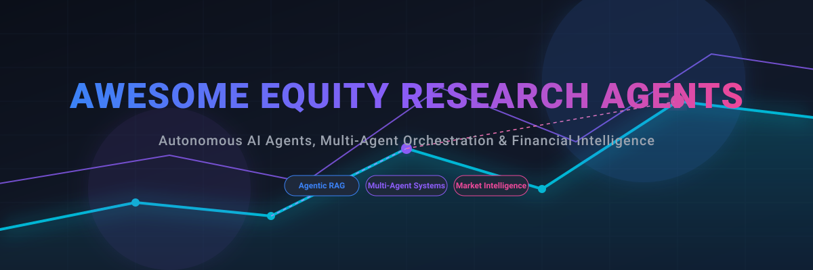

# 📈 Awesome Equity Research Agents & Agentic Workflows

  

  
  
  
  
  

---

## 🔍 Overview & Financial Intelligence

**Curated List of SaaS Products & Open-Source GitHub Projects**  
*Focused on Agentic RAG, Multi-Agent Orchestration, and Autonomous Research Pipelines*  
**Last updated: May 2026**

This repository tracks the frontier of **Equity Research AI Agents**, **Autonomous Financial AI**, and **Agentic Workflows**. Unlike traditional LLM chatbots, these systems utilize multi-step reasoning, autonomous tool-use, and multi-agent collaboration to perform deep company analysis, financial modeling, and real-time market monitoring.

**Targeting**: Buy-side analysts, Hedge Funds, Asset Managers, and Fintech Developers building the next generation of **Autonomous Financial Intelligence**.

---

## 🚀 Why Agentic Equity Research?

In 2026, "AI Copilots" have evolved into **Autonomous Research Agents**. This repository focuses on tools that enable:
- **Multi-Agent Orchestration**: Specialized agents (Analyst, Modeler, Risk Manager) debating to reach high-conviction investment theses.
- **Verifiable RAG**: Enterprise-grade retrieval with 100% source-grounded citations from SEC filings, transcripts, and news.
- **Agentic Financial Modeling**: Zero-shot generation of DCF, LBO, and three-statement models from raw data.
- **Autonomous Discovery**: Agents that proactively monitor "dark data" and "alternative signals" to identify alpha.

---

## 📋 Table of Contents
- [💼 SaaS Platforms & Enterprise Solutions](#saas-platforms--enterprise-solutions)
- [💻 Open-Source GitHub Repositories](#open-source-github-repositories)
- [🎯 Niche Use Cases & Agentic Workflows](#niche-use-cases--agentic-workflows)
- [🛠️ Agentic AI Frameworks for Finance](#agentic-ai-frameworks-for-finance)
- [💬 FAQ (Frequently Asked Questions)](#faq-frequently-asked-questions)
- [🤝 How to Contribute](#how-to-contribute)
- [⚠️ Disclaimer](#disclaimer)

---

## 💼 SaaS Platforms & Enterprise Solutions

### Professional Agent Platforms (Enterprise Grade)

| SaaS Product | Description / Agentic Value | Pricing | Free Tier / Limits | Company Size (Valuation/Revenue) |
| :--- | :--- | :--- | :--- | :--- |
| **[Bloomberg (ASKB / Terminal Agents)](https://www.bloomberg.com/)** | Integrating agentic capabilities directly into the Terminal for natural language querying of the world's deepest financial data lake. | $31,980/seat/year (volume discounts available) | None | ~$120 Billion Valuation / ~$15 Billion Revenue (Est.) |
| **[AlphaSense](https://www.alpha-sense.com/)** | Market intelligence platform with **AI-powered sentiment tracking** and semantic search across premium financial datasets. | Custom Enterprise (est. $10,000–$40,000+/seat/year, contact sales) | None (offers free trial for qualified organizations) | ~$7.5 Billion Valuation / >$600 Million ARR |
| **[Hebbia (Matrix Agents)](https://www.hebbia.com/)** | The leader in **Matrix Agents** for deep, multi-document analysis. Specialized in handling 10-Ks, earnings calls, and complex private credit documents with agentic reasoning. | Custom Enterprise (not publicly disclosed, contact sales) | None | ~$700 Million Valuation / ~$13 Million ARR |
| **[Prospero.ai](https://prospero.ai/)** | Autonomous agents for generating **professional-grade equity research reports** and institutional investment theses. | Free core app features; premium features available | Yes (free access to core app features, real-time signals, daily picks) | ~$15 Million Valuation (Est.) |
| **[Energent.ai](https://energent.ai/)** | Zero-code AI agent platform with 94.4% accuracy on financial benchmarks. Excellent for automating **sector-specific market intelligence**. | Custom Enterprise (contact sales) | None (offers a free trial to test tools) | N/A (Private / Seed Stage) |
| **[FilingFirehose](https://filingfirehose.com/)** | SEC EDGAR risk-scoring platform with **AI per-ticker reports** that surface 8-K cyber incidents, dilution, restatement risk, and officer departures across any US-listed company. Includes a hosted MCP endpoint at `https://filingfirehose.com/mcp` for agents. | Starts at $29/month | Yes (access to SEC filings from the past 72 hours, no API key required) | N/A (Private / Bootstrapped) |

---

## 💻 Open-Source GitHub Repositories

- **[TauricResearch/TradingAgents](https://github.com/TauricResearch/TradingAgents)**   
  A "Trading Firm in a Box" using LangGraph to orchestrate Fundamental, Technical, and Risk Management agents.

- **[RAGFlow](https://github.com/infiniflow/ragflow)**   
  An enterprise-grade RAG engine with deep document understanding—essential for building **SEC Filing Analysis Agents**.

- **[OpenBB](https://github.com/OpenBB-finance/OpenBB)**   
  The "Open Source Bloomberg" now featuring AI extensions for terminal-based agentic research.

- **[ai-hedge-fund](https://github.com/virattt/ai-hedge-fund)**   
  A trending framework that uses a **Multi-Agent Debate Model** (Bull vs. Bear) to analyze stocks and reach investment conclusions.

- **[Agno (formerly Phidata)](https://github.com/phidatahq/phidata)**   
  Framework for building autonomous AI agents with memory and tool-use. Ideal for custom **Financial RAG pipelines**.

- **[FinRobot](https://github.com/ai4finance-foundation/FinRobot)**   
  Open-source AI agent platform for financial applications, including specialized agents for fundamental analysis and report generation.

- **[xvary-research/Stock-Research](xvary-research/claude-code-stock-analysis-skill)**   
  Specialized skill for Claude Code that integrates SEC EDGAR data for automated stock scoring and comparison.

---

## 🎯 Niche Use Cases & Agentic Workflows

Targeting narrow, high-impact research tasks:
- **Earnings Call Synthesis**: Autonomous agents that cross-reference transcripts against historical guidance to detect "strategic pivots."
- **SEC 10-K/Q Delta Analysis**: Identifying subtle changes in risk factors or management discussion between filings.
- **Competitive Intelligence Swarms**: Deploying multiple agents to monitor competitor pricing, news, and social sentiment in real-time.
- **ESG & Policy Impact Agents**: Analyzing the effect of localized regulations on global supply chains and equity valuations.

---

## 🛠️ Agentic AI Frameworks for Finance

Frameworks most used in the financial sector for building agents:
- **[LangGraph](https://github.com/langchain-ai/langgraph)**: For stateful, cyclic agent workflows (e.g., iterative financial modeling).
- **[CrewAI](https://github.com/crewAIInc/crewAI)**: For role-based multi-agent teams (e.g., Analyst + Reviewer + Editor).
- **[DSPy](https://github.com/stanfordnlp/dspy)**: For programmatically optimizing financial prompts for maximum extraction accuracy.
- **[MCP (Model Context Protocol)](https://modelcontextprotocol.io/)**: The emerging standard for connecting agents to financial databases and APIs safely.

---

## 💬 FAQ (Frequently Asked Questions)

### How do AI agents differ from Financial Chatbots?
Traditional chatbots are reactive and single-turn. **Equity Research Agents** are proactive, use tools (calculators, web search, database queries), and perform multi-step workflows to verify information across multiple sources.

### Can I run these agents locally for data privacy?
Yes. Using frameworks like **Ollama**, **Agno**, and **OpenClaw**, you can deploy agents on local hardware to ensure that proprietary research and sensitive client data never leave your infrastructure.

### Which agents are best for SEC filing analysis?
**Hebbia** and **AlphaSense** lead in SaaS, while **RAGFlow** and **FinRobot** are the top open-source choices for building custom SEC analysis pipelines.

---

## 🤝 How to Contribute

1. Fork the repo.
2. Add/edit entries (focus on **Agentic** capabilities).
3. Follow the format: `[Name](Link) - Description focusing on agentic value.`
4. Submit PR.

---

## ⚠️ Disclaimer

*AI-generated financial analysis is for informational purposes only and NOT financial advice. Always consult licensed professionals. This repository is community-curated.*

---

**Built for the next generation of AI-Native Analysts.**

## 📈 Star History

	<a href="https://www.star-history.com/?repos=ishandutta2007%2FAwesome-Equity-Research-Agent&type=date&legend=bottom-right">
	 <picture>
	   <source media="(prefers-color-scheme: dark)" srcset="https://api.star-history.com/chart?repos=ishandutta2007/Awesome-Equity-Research-Agent&type=date&theme=dark&legend=bottom-right" />
	   <source media="(prefers-color-scheme: light)" srcset="https://api.star-history.com/chart?repos=ishandutta2007/Awesome-Equity-Research-Agent&type=date&legend=bottom-right" />
	   
	 </picture>
	</a>

